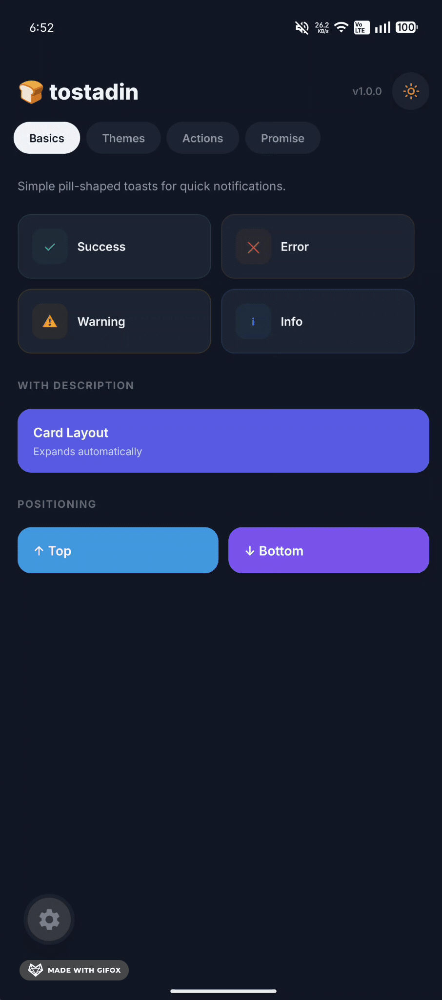
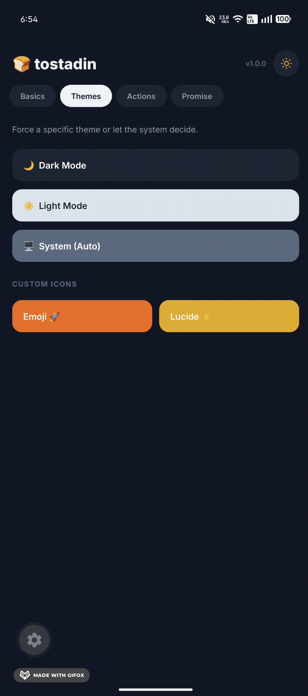
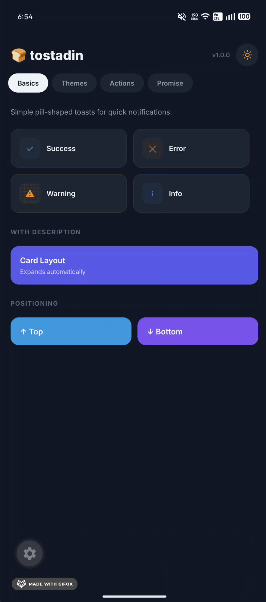
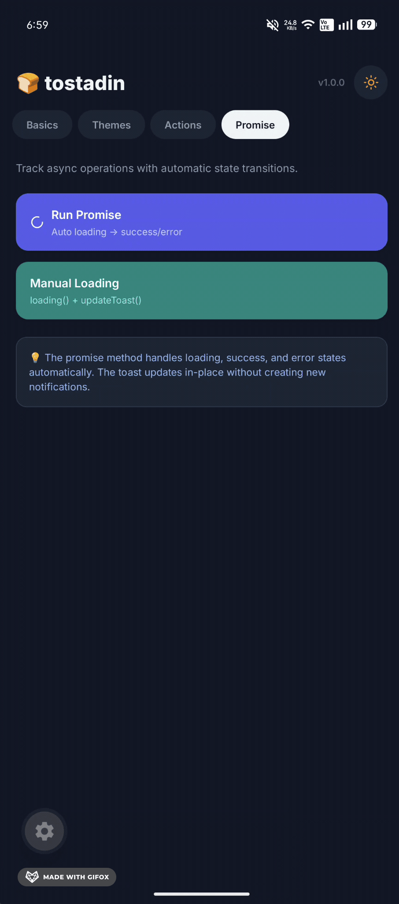

# 🍞 tostadin-rn

A beautiful, gesture-driven toast notification system for React Native — inspired by [Sileo](https://sileo.aaryan.design/).

**Zero native dependencies.** Works with React Native CLI and Expo out of the box.

---

## Features

- 🎨 **Light & Dark mode** — automatic system detection or manual override
- 📍 **Positioning** — `top` or `bottom`
- 👆 **Swipe-to-dismiss** — native PanResponder gestures
- ⏳ **Promise support** — loading → success/error transitions
- 🧩 **Custom icons** — bring your own (Lucide, FontAwesome, emoji, Image…)
- 🎯 **Action buttons** — interactive buttons inside the toast
- 💅 **Fully customizable** — override any style via props

<p align="center">
  
  
  
</p>

---

## Installation

```bash
npm install tostadin-rn
# or
yarn add tostadin-rn
```

### Optional: Icons

tostadin-rn does **not** require any icon library. If you want icons, install your favorite one:

```bash
yarn add lucide-react-native react-native-svg
```

---

## Quick Start

Wrap your app with `ToastProvider` and use the `useToast` hook anywhere.

```tsx
import { ToastProvider, useToast } from 'tostadin-rn';

export default function App() {
  return (
    <ToastProvider>
      <HomeScreen />
    </ToastProvider>
  );
}

function HomeScreen() {
  const { success } = useToast();

  return <Button title="Save" onPress={() => success('Saved!')} />;
}
```

---

## API Reference

### `useToast()`

Returns an object with the following methods:

| Method        | Signature                                 | Description                     |
| ------------- | ----------------------------------------- | ------------------------------- |
| `success`     | `(message, description?, options?) => id` | Green success toast             |
| `error`       | `(message, description?, options?) => id` | Red error toast                 |
| `warning`     | `(message, description?, options?) => id` | Yellow warning toast            |
| `info`        | `(message, description?, options?) => id` | Blue info toast                 |
| `loading`     | `(message, description?, options?) => id` | Spinner toast (no auto-dismiss) |
| `showToast`   | `(options) => id`                         | Full control toast              |
| `updateToast` | `(id, options) => void`                   | Update an existing toast        |
| `promise`     | `(promise, options) => Promise<T>`        | Track a promise lifecycle       |

### `ToastOptions`

| Prop               | Type                                                       | Default      | Description                             |
| ------------------ | ---------------------------------------------------------- | ------------ | --------------------------------------- |
| `message`          | `string`                                                   | **required** | Main text                               |
| `description`      | `string`                                                   | —            | Secondary text (expands to card layout) |
| `type`             | `'success' \| 'error' \| 'warning' \| 'info' \| 'loading'` | `'info'`     | Visual style                            |
| `duration`         | `number`                                                   | `3000`       | Auto-dismiss in ms (`0` = never)        |
| `theme`            | `'light' \| 'dark' \| 'system'`                            | `'system'`   | Color scheme                            |
| `position`         | `'top' \| 'bottom'`                                        | `'top'`      | Screen position                         |
| `icon`             | `ReactNode`                                                | —            | Custom icon component                   |
| `action`           | `ToastAction`                                              | —            | Interactive button                      |
| `style`            | `ViewStyle`                                                | —            | Container style override                |
| `messageStyle`     | `TextStyle`                                                | —            | Message text style override             |
| `descriptionStyle` | `TextStyle`                                                | —            | Description text style override         |

### `ToastAction`

| Prop         | Type         | Description                |
| ------------ | ------------ | -------------------------- |
| `label`      | `string`     | Button text                |
| `onPress`    | `() => void` | Callback                   |
| `style`      | `ViewStyle`  | Button style override      |
| `labelStyle` | `TextStyle`  | Button text style override |

---

## Usage Examples

### Basic Toasts

```tsx
const { success, error, warning, info } = useToast();

success('Profile saved');
error('Something went wrong');
warning('Low storage');
info('New version available');
```

<p align="center">
  
</p>

### With Description

When you add a `description`, the toast automatically expands from a pill to a card layout.

```tsx
success('Changes Saved', 'Your profile has been updated successfully.');
```

### Themes

```tsx
// Force dark mode
info('Dark Toast', 'Always dark', { theme: 'dark' });

// Force light mode
info('Light Toast', 'Always light', { theme: 'light' });

// Follow system (default)
info('System Toast', 'Adapts automatically');
```

<p align="center">
  
</p>

### Positioning

```tsx
// Bottom of the screen
success('Bottom toast!', undefined, { position: 'bottom' });

// Top (default)
success('Top toast!');
```

### Custom Icons

You can pass **any** `ReactNode` as an icon.

```tsx
// With Lucide
import { CheckCircle2 } from 'lucide-react-native';
success('Saved', undefined, {
  icon: <CheckCircle2 size={18} color="#10b981" />,
});

// With an emoji
info('Launched!', undefined, {
  icon: <Text style={{ fontSize: 18 }}>🚀</Text>,
});

// With an Image
info('Welcome', undefined, {
  icon: (
    <Image source={require('./avatar.png')} style={{ width: 18, height: 18 }} />
  ),
});
```

### Action Buttons

```tsx
info('File Uploaded', 'Share it with your team?', {
  duration: 5000,
  action: {
    label: 'Share Now',
    onPress: () => shareFile(),
  },
});
```

### Custom Styled Action

```tsx
warning('Booking Confirmed', 'Check-in starts in 2h.', {
  action: {
    label: 'View Details',
    onPress: () => navigate('Details'),
    style: { backgroundColor: 'rgba(245, 158, 11, 0.2)' },
    labelStyle: { color: '#b45309' },
  },
});
```

<p align="center">
  
</p>

### Promise Tracking

Track async operations with automatic state transitions.

```tsx
const { promise } = useToast();

// Simple strings
promise(fetchData(), {
  loading: 'Loading data...',
  success: 'Data loaded!',
  error: 'Failed to load',
});

// Dynamic messages based on the result
promise(uploadFile(), {
  loading: { message: 'Uploading...', description: 'Please wait' },
  success: (data) => ({
    message: 'Upload Complete!',
    description: `${data.fileName} is ready.`,
  }),
  error: (err) => ({
    message: 'Upload Failed',
    description: err.message,
  }),
});
```

<p align="center">
  
</p>

### Loading Toast (Manual)

```tsx
const { loading, updateToast } = useToast();

const id = loading('Processing...');

// Later, update it manually
updateToast(id, {
  type: 'success',
  message: 'Done!',
  duration: 3000,
});
```

### Full Control with `showToast`

```tsx
const { showToast } = useToast();

showToast({
  message: 'Custom Toast',
  description: 'Full control over every option.',
  type: 'info',
  theme: 'dark',
  position: 'bottom',
  duration: 5000,
  icon: <MyCustomIcon />,
  style: { borderRadius: 16 },
  messageStyle: { fontSize: 16 },
  action: {
    label: 'Dismiss',
    onPress: () => {},
  },
});
```

---

## Gestures

Toasts respond to touch automatically:

| Position | Swipe Direction | Result  |
| -------- | --------------- | ------- |
| `top`    | ↑ Swipe up      | Dismiss |
| `bottom` | ↓ Swipe down    | Dismiss |

- **Hold**: Pauses the auto-dismiss timer while touching.
- **Partial swipe**: Springs back to original position.

---

## Architecture

```
src/
├── core/          # Internal logic (toast creation, promise resolution)
├── components/    # UI (Toast, ToastIcon, styles)
├── hooks/         # Public hooks (useToast)
├── context/       # ToastProvider
├── utils/         # Helpers (theme, position)
├── constants/     # Colors, animation configs
├── types/         # Public TypeScript types
└── index.tsx      # Entry point
```

---

## TypeScript

All types are exported for your convenience:

```tsx
import type {
  ToastType,
  ToastTheme,
  ToastPosition,
  ToastAction,
  ToastProps,
  ToastOptions,
  PromiseOptions,
  ToastContextType,
} from 'tostadin-rn';
```

---

## License

MIT © [Damian Palomo](https://github.com/PedroDmian)
